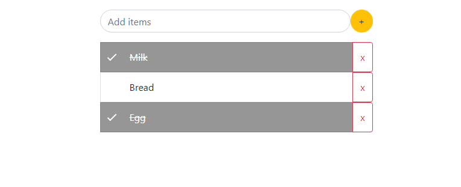

# Basic To-Do Application Using Jquery & localStorage

---

A Simple To-Do app. Using `html`, `css`, `js` & `jQuery`.

check out [Here](https://robinsingh1912.github.io/To-Do/)

> Its all save your data on `localStorage` so that you can modify it later.
